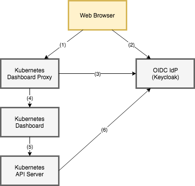

# Kubernetes Dashboard Proxy [](https://circleci.com/gh/int128/kubernetes-dashboard-proxy)

A Helm chart with [keycloak-proxy](https://github.com/gambol99/keycloak-proxy) to protect the Kubernetes Dashboard with OpenID Connect (OIDC).




## TL;DR

You can install the charts as follows:

```sh
# Kubernetes Dashboard
helm install stable/kubernetes-dashboard --namespace kube-system --name kubernetes-dashboard

# Kubernetes Dashboard Proxy
helm repo add int128.github.io https://int128.github.io/helm-charts
helm repo update
helm install int128.github.io/kubernetes-dashboard-proxy --namespace kube-system --name kubernetes-dashboard-proxy -f kubernetes-dashboard-proxy.yaml
```

1. Setup your OIDC Identity Provider
1. Setup the Kubernetes API Server
1. Install the Kubernetes Dashboard and Proxy
1. Assign a Role


## Getting Started

### 1. Setup your OIDC Identity Provider

Setup an OIDC client as follows:

- Issuer URL: `https://keycloak.example.com/auth/realms/hello`
- Redirect URL: `https://kubernetes-dashboard.example.com/*`
- Client ID: `kubernetes`
- Client Secret: `Mx3xL96Ixn7j4ddWOCH1l8VkB6fiXDBW` (this is an example, usually generated random string)
- Groups claim: `groups` (optional for group based access controll)

If you are using Keycloak, see also [this article](https://medium.com/@int128/protect-kubernetes-dashboard-with-openid-connect-104b9e75e39c).


### 2. Setup the Kubernetes API Server

Setup the Kubernetes API Server accepts an OIDC ID token.

If you are using kops, `kops edit cluster` and append the following settings:

```yaml
spec:
  kubeAPIServer:
    oidcClientID: kubernetes
    oidcGroupsClaim: groups
    oidcIssuerURL: https://keycloak.example.com/auth/realms/hello
```


### 3. Install the Kubernetes Dashboard and Proxy

You can install [the Kubernetes Dashboard](https://github.com/kubernetes/charts/tree/master/stable/kubernetes-dashboard) as follows:

```sh
helm install stable/kubernetes-dashboard --namespace kube-system --name kubernetes-dashboard
```

You can install the Kubernetes Dashboard Proxy as follows:

```sh
helm repo add int128.github.io https://int128.github.io/helm-charts
helm repo update
helm install int128.github.io/kubernetes-dashboard-proxy --namespace kube-system --name kubernetes-dashboard-proxy -f kubernetes-dashboard-proxy.yaml
```

You can set the following values for the Kubernetes Dashboard Proxy.
See also [kubernetes-dashboard-proxy.yaml](kubernetes-dashboard-proxy.yaml).

Parameter | Description | Default
----------|-------------|--------
`proxy.oidc.discoveryURL` | Discovery URL. | (mandatory)
`proxy.oidc.clientID` | Client ID. | (mandatory)
`proxy.oidc.clientSecret` | Client secret. | (mandatory)
`proxy.oidc.redirectURL` | Redirect URL. This may be same to the external URL in most cases. | (mandatory)
`proxy.cookieEncryptionKey` | Encryption key to store a session to a browser cookie. This should be 16 or 32 bytes string. | 32 bytes random string
`proxy.upstreamURL` | Kubernetes Dashboard service URL. | `https://kubernetes-dashboard.kube-system.svc.cluster.local`.
`ingress.enabled` | Enable ingress controller resource. | `false`
`ingress.hosts` | Hostnames | `[]`

#### nginx-ingress

If you are using [nginx-ingress](https://github.com/kubernetes/ingress-nginx), make sure `proxy_buffer_size` option is larger than 4kB.
You can set it in the ConfigMap of nginx-ingress.

```yaml
    proxy-buffer-size: "64k"
```


### 4. Assign a role

Open `https://kubernetes-dashboard.example.com`.

At this time, an `Unauthorized` error may appear on the dashboard because you have no role.

Here assign the `cluster-admin` role to the current group.

```yaml
kind: ClusterRoleBinding
apiVersion: rbac.authorization.k8s.io/v1
metadata:
  name: keycloak-admin-group
roleRef:
  apiGroup: rbac.authorization.k8s.io
  kind: ClusterRole
  # NOTE: This is a super administrator and can do everything.
  # Consider a dedicated role in your actual operation.
  name: cluster-admin
subjects:
# If you want to specify the current user
- kind: User
  name: https://keycloak.example.com/auth/realms/hello#874c4a74-faf3-45a0-bcfe-9ddf4fb802ea
# If you want to specify the current group
- kind: Group
  name: /admin
```

Congratulations!
Now all objects should appear in the dashboard.


## Advanced

### Manage the charts using Helmfile

You can manage the following charts using [Helmfile](https://github.com/roboll/helmfile).

- Kubernetes Dashboard Proxy
- [Kubernetes Dashboard](https://github.com/kubernetes/charts/tree/master/stable/kubernetes-dashboard)
- [Heapster](https://github.com/kubernetes/charts/tree/master/stable/heapster)

Export the environment values and run `helmfile sync`.
See [helmfile.yaml](helmfile.yaml) for details.

```sh
export YOUR_DOMAIN=example.com
export YOUR_OIDC_DISCOVERY_URL=https://keycloak.${YOUR_DOMAIN}/auth/realms/hello
export YOUR_CLIENT_SECRET=Mx3xL96Ixn7j4ddWOCH1l8VkB6fiXDBW
helmfile sync
```


## Special thanks

This depends on [gambol99/keycloak-proxy](https://github.com/gambol99/keycloak-proxy).
Thank you for the great work.


## Contributions

This is an open source software licensed under Apache License 2.0.
Feel free to open issues or pull requests.
